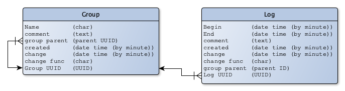

# Time Tracking RESTful API

## Data model

## Style Guide

The interactions are defined like this:

	VERB baseURL/type/id{?parameters(as key=value)}

- The first word is the HTTP verb used for the interaction (GET, POST, UPDATE, DELETE)

- Content surrounded by {} is optional and will be replaced by the string literal identified. Possible insertion values:

	- baseURL: The Service Base URL
	- type: The ID of a group
	- id: The logical ID of a group or log
	- parameters: URL parameters as defined for the particular interaction

### Service Base URL 

The Service Base URL is the address where all of the groups and logs defined by this interface are found. The Service Base URL takes the form of

	http{s}://server{/path}/id

The path portion is optional, and does not include a trailing slash.

	https://server/path/group/12345

	https://server/path/log/54321

## Functions

### User interaction

#### User login

	POST [baseURL]/accounts/login

Login returns a token. All following functions work with this token.

#### User logout

	POST [baseURL]/accounts/logout

### Group interaction

#### create new group

	POST [baseURL]/group
	
#### create new group to a parent group

	POST [baseURL]/group?parent=12345

#### get all groups without any parent

getGroups without ID gets all groups without parent

	GET [baseURL]/groups

#### get groups to a parent

getGroups with ID gets all sub groups to a parent ID (e.g. stories to a project)

	GET [baseURL]/groups/[parentID] 

getGroups without ID and Parameter `depth` gets all groups and sub groups down to that level. For example all stories to a specific group:

	GET [baseURL]/group/12345?depth=2

Or all stories and tasks to a specific group:

	GET [baseURL]/group/12345?depth=3

#### update a group

	UPDATE [baseURL]/group/ID

#### delete a group

	DELETE [baseURL]/group/ID

### Log interaction

#### create new log entry to a specific parent (group ID)

	POST [baseURL]/logs/[parentID]
	
#### get all log entries to a specific parent (group ID)

	GET [baseURL]/logs/[groupID]

#### update a log entry

	UPDATE [baseURL]/log/[ID]

#### delete a log entry

	DELETE [baseURL]/log/ID
