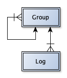

# Time Tracking RESTful API

The documentation of time spent on projects is often the most annoying task that employees have to do in projects. Therefore, the documentation of activities is often done later or the time spent on the project is estimated. Both lead to incomplete or even missing activities that are not billed.

Therefore, there are many applications and apps available to simplify time tracking. However, these are often part of complex applications, of which only a few functions are used. The costs of the applications therefore often exceed the benefit that time recording would bring.

In addition, there is no standardised interface or data model available, so developers can create small apps that can be integrated into any IT landscape.

This **Time Tracking RESTful API** (*TTREST*) is intended to help solve these problems. It is intended to provide a collection of API functions that can be picked up by different developers to implement different applications that work with the same functions.

This will allow different applications to use the same middle ware to record time in any database.

## Data model

The data model is based on two fundamental objects. On the one hand, on the log of times (*Log*) and on the other hand on the hierarchical grouping (*Group*) of parent structures (e.g. projects, stories and tasks). Each log entry is assigned to a parent group (e.g. a task).

This model maps the hierarchy through a recursion of the groups. A project is therefore the parent group of projects. A project, in turn, is the parent group of tasks and the log entries are recorded for the tasks. This provides a further use for more extensive hierarchies with even more levels; in the same way, only one level can be used and all log entries can be recorded below it.

Each entry - no matter if group or log - is described by different fields. To ensure uniqueness, each object has an ID (*UUID*).

## Style Guide

The interactions are defined like this:

	VERB baseURL/type/id{?parameters(as key=value)}

- The first word is the HTTP verb used for the interaction (GET, POST, UPDATE, DELETE)

- Content surrounded by {} is optional and will be replaced by the string literal identified. Possible insertion values:

	- baseURL: The Service Base URL
	- type: The ID of a group
	- id: The logical ID of a group or log
	- parameters: URL parameters as defined for the particular interaction

### Service Base URL 

The Service Base URL is the address where all of the groups and logs defined by this interface are found. The Service Base URL takes the form of

	http{s}://server{/path}/id

The path portion is optional, and does not include a trailing slash.

	https://server/path/group/12345

	https://server/path/log/54321

## Functions

### User interaction

#### User login

	POST [baseURL]/accounts/login

Login returns a token. All following functions work with this token.

#### User logout

	POST [baseURL]/accounts/logout

### Group interaction

#### create new group

	POST [baseURL]/groups
	
#### create new group to a parent group

	POST [baseURL]/groups
	
	{
		"parent": parentID,
		...
	}

#### get all groups without any parent

getGroups without ID gets all groups without parent

	GET [baseURL]/groups

#### get groups to a parent

getGroups with ID gets all sub groups to a parent ID (e.g. stories to a project)

	GET [baseURL]/groups/[parentID] 

getGroups without ID and Parameter `depth` gets all groups and sub groups down to that level. For example all stories to a specific group:

	GET [baseURL]/groups/12345?depth=2

Or all stories and tasks to a specific group:

	GET [baseURL]/groups/12345?depth=3

#### update a group

	UPDATE [baseURL]/groups/ID

#### delete a group

	DELETE [baseURL]/groups/ID

### Log interaction

#### create new log entry to a specific parent (group ID)

	POST [baseURL]/logs
	
	{
		"parent": groupID,
		...
	}
	
#### get all log entries to a specific parent (group ID)

	GET [baseURL]/logs/[groupID]

#### update a log entry

	UPDATE [baseURL]/logs/ID

#### delete a log entry

	DELETE [baseURL]/logs/ID
